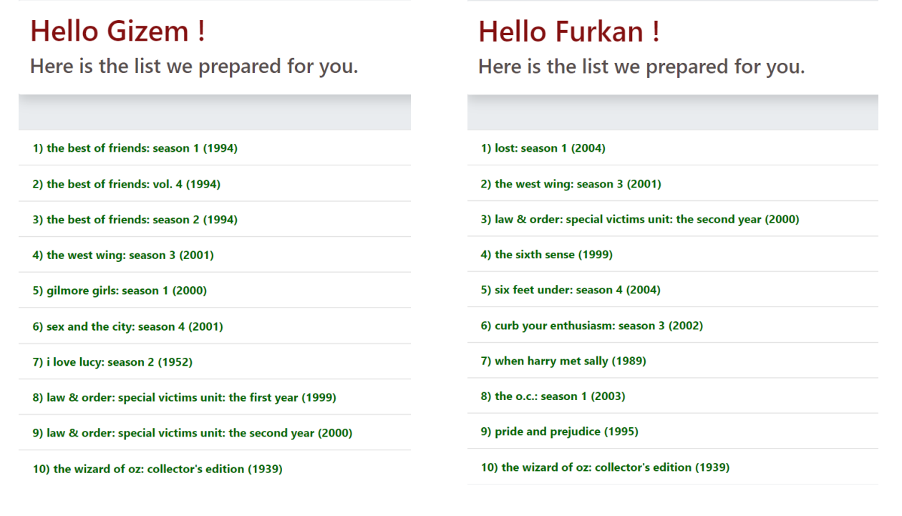

# “Movie Runner”

### Collaborative Filtering Based Movie Recommendation System

### 20/11/2020

Movie Runner is a model that recommends 10 movies to be liked by each person, based on their rating for movies. Netflix Prize Data was used as a dataset. At the same time, the movies we watched and rated were added to the dataset. Collaborative Filtering algorithm is used with the help of SVD (Singular Value Decomposition) method. Similar users and similar movies are detected by the algorithm by assigning a vector to all movies and users. Then, movies liked by users with the same movie taste are recommended to the person. According to the answer to the question "How many points would he/she give it if he/she watched" the movies that each user has not watched before, it finds the points and the highest 10 scores, and recommends these movies to the user. 

A website was created for the model with the help of Python's Flask framework. When the name of a user in the dataset is entered on this website, 10 movies will be recommended to that user.

In the picture below, you can see movie recommendations for 2 different users on the website. Gizem and Furkan are my teammates. We included their name and the movies they rated in our data set. And then we were able to get predictions from the model for them as well.

